# Text-summarization

## Why we should choose text summarization as a research topic :confused:
<details>
  <summary> Click to expand! </summary>
From my perspective, when I started to research. I was confused, which topics I should choose? Then I started to research it.  I found so many topics in NLP, but the problem is, every topic is in a stable phase. I was worried about it. After that, I found text summarization and it was not in a stable phase. Because text summarization has no accurate answer that can measure, how much good your model. And also this was a challenging topic. I got inspiration.

Another thing I found that in my country there was no better model published. So the first thing in any research is, "Is this topic already in a stable phase?". Still, text summarization is an amazing topic for research.
</details>

## Now how to start this topic? :face_with_head_bandage:
<details>
  <summary> Introduction </summary>
In any research, first, we need to know about that topic. In this case, we will do the same thing. We will search on google about this topic. Learn What is text summarization? :laughing: . Just spend 2-3 days about it.

2-3 days needed to make mindset. Now you should start reading papers about text summarization. At least you should read 10-20 papers.
</details>

<details>
  <summary> How can i get papers about this topic? </summary>
  It is a basic problem, where we will find the paper. The simple answer is google scholar. Google scholar collects all the research papers from all the research and journal sites.

So simply go [scholar](https://scholar.google.com)
</details>

<details>
  <summary> Lots of paper were premium version, I can't access it</summary>
 I am also depressed about it. How to access them!  After researching somedays, 
  I found an interesting ( https://sci-hub.se  )
  In this site, we can access lots of papers freely.
</details>

<details>
  <summary>Yes i can access it now, but which paper whould i read first?</summary>
  In scholar, we can easily select the year. So first read old papers. Cause we won't understand easily recent papers.
</details>

<details>
  <summary>Yes i read some papers. But i can't understand anything.</summary>
 
  After reading these papers, you will find some new keywords. These keywords will make you depressed.
  Cause without 1 or 2 papers you won't understand what exactly these papers did. :laughing: 
</details>

## How can i understand text summarization paper?

<details>
  <summary>Introduction</summary>
   I also same issue. I can't understand anything. Then i understood that i was stacked in some keywords. Maximum keywords were deep learning keywords. Then i started to learn deep learning. 
  
</details>

### Essential Deep Learning topics for text summarization
<details>
  <summary>Tokenization</summary>
  Tokenization is a common task in Natural Language Processing (NLP). It’s a fundamental step in both traditional NLP methods like Count Vectorizer and Advanced Deep Learning-based architectures like Transformers.
Tokenization can be performed on word, character, or subword level.

    1. word: "I live in dhaka" = I-Live-in-dhaka(4 tokens)
    2. character: "Dhaka" = D-h-a-k-a (5 Tokens)
    3. subword: "smarter" = smart-er(2 Tokens)

So, simply tokenization is the process of dividing word or character. But why we need token?
Because of the processing of text data. For every text related model, if we need to run in a large corpus, we need tokenization. Tokenization makes a connection with vocabulary. So in preprocessing, the first step is tokenization.
 </details>

<details>
  <summary>Normalization</summary>
When we normalize a natural language resource, we attempt to reduce the randomness in it, bringing it closer to a predefined “standard”. Thats why normalization in NLP is very important.
Normalization has different types of techniques.

    1. Tokenization: We already know about "How to make tokens from input".
    2. Stemming: This process will make every word in its root from. That means lowest form of a word. example: "Change,Changing,changer" to "chang".
    3. lemmatization: This also same to Stemming but not always make root from.
    4. Sentencizing: From a document it will take every sentences and remove every punctuation or symbol. Sometimes it will make everything lower form for better result. For every document we must do this process.
    5. reference resolution: Sometimes we need to make every third person to first person form for better accuracy. Reference resolution helps it.

</details>

<details>
  <summary>TF/IDF</summary>
TF-IDF is a statistical measure that evaluates how relevant a word is to a document in a collection of documents.
The full form of TF is Term Frequency (TF).The full form of IDF is Inverse Document Frequency.

**TF** = no. of times term occurrences in a document / total number of words in a document

**IDF** = log base e (total number of documents / number of documents which are having term )

There are lots of library in every language for measuring TF-IDF.
In NLP, TF/IDF is a necessary step for information retrieval and keyword Extraction. In-Text summarization, as we need to find information from sentences Tf/IDF does that for us. It was much simple and faster than any other model.
</details>

<details>
  <summary>Stopwords</summary>
Stopwords are the words in any language which does not add much meaning to a sentence. They can safely be ignored without sacrificing the meaning of the sentence.

Suppose, a sentence **"Dhaka is the capital city of bangladesh"** . after removing stop words it looks like ** Dhaka capital city bangladesh** . See, it doesn't change the meaning.
So why we need it?

    1. Stopwords are rapidly used in sentences. So for getting usefull information, this always create problems.
    2. Without stopwords, our model computational power will be better.
    3. without stopwords, we can get better accuracy.


In english language nltk library marked **127 words** as a stop words.

```
i, me, my, myself, we, our, ours, ourselves, you, your, yours, yourself,yourselves,
he, him, his, himself, she, her, hers, herself, it, its, itself, they, them,their, 
theirs, themselves, what, which, who, whom, this, that, these, those, am, is,are, 
was, were, be, been, being, have, has, had, having, do, does, did, doing, a, an, 
the, and, but, if, or, because, as, until, while, of, at, by, for, with, about, 
against, between, into, through, during, before, after, above, below, to, from, 
up, down, in, out, on, off, over, under, again, further, then, once, here, there,
when, where, why, how, all, any, both, each, few, more, most, other, some, such,
no, nor, not, only, own, same, so, than, too, very, s, t, can, will, just, don,
should, now
```
we can customize it.

</details>


<details>
  <summary>Jaccard Similarity</summary>

The **Jaccard index**, also known as **Intersection over Union** and **the Jaccard similarity coefficient** (originally given the French name coefficient de communauté by Paul Jaccard), is a statistic used for gauging the similarity and diversity of sample sets.

=%20\frac{|A\cap%20B|}{|A\cup%20B|}%20=%20\frac{|A\cap%20B|}{|A|+|B|-|A\cap%20B|)


%20=%201-J(A,B)=\frac{|A\cup%20B|-|A\cap%20B|}{|A\cup%20B|})

Here,  represents the number of common words between the set A and B;
 represents total number of distinct words in the set A and B.
Why we need it?

Finding the relation between two sentences or vectors.
</details>

<details>
  <summary>Cosine Similarity</summary>

As like as jaccard Similarity, Cosine similarity also works for finding relation of vectors.
Given two vectors of attributes, A and B, the cosine similarity, ) , is represented using a dot product and magnitude as

%20=%20\frac{A.B}{||A||\hspace{2pt}||B||}%20=%20\frac{\sum^n_{i=1}%20A_i%20B_i}{\sqrt{\sum^n_{i=1}%20A^2_i}\sqrt{\sum^n_{i=1}%20B^2_i}})

where A_i and B_i are components of vector A and B respectively.

</details>


<details>
  <summary>Hadamard Product</summary>

In mathematics, the Hadamard product (also known as the element-wise, entrywise or Schur product) is a binary operation that takes two matrices of the same dimensions and produces another matrix of the same dimension as the operands, where each element i, j is the product of elements i, j of the original two matrices.

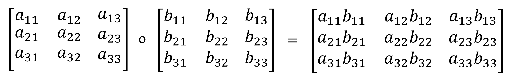

</details>


<details>
  <summary>ReLU Activation Function</summary>
ReLU stands for rectified linear unit, and is a type of activation function. It is widely used in Activation Function.

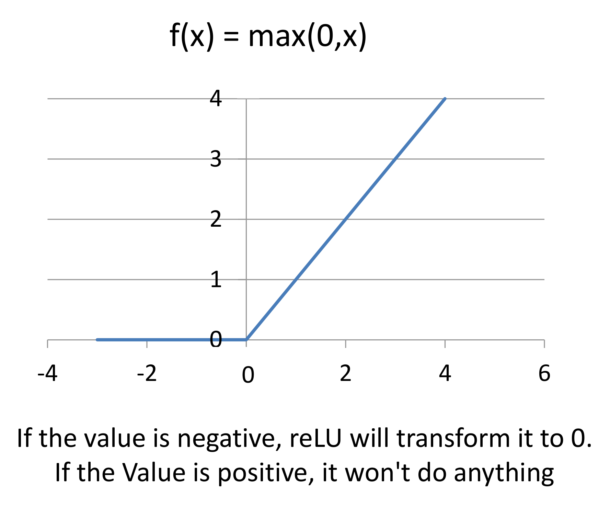
why do we use ReLU, if we already have sigmoid?


    1. it takes less time to train or run.
    2. It is very faster than other models.  Cause there is no complex equation. It doesn’t have the vanishing gradient problem suffered by other activation functions like sigmoid or tanh.

But in relu, if the number is negative it will make number 0. So, if all number is negative, it don't activated the function. And it's called Dying ReLU.

ReLU has so many version. **Leaky ReLU** is mostly used in deep learning. Instead of making 0, it makes negative value to multiple of a constant factor.
</details>


<details>
  <summary>tanh activation function</summary>

In sigmoid function, every value transform 0 to 1. In tanh function instead of 0 to 1, it makes -1 to 1.

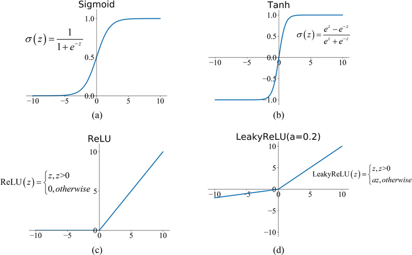

</details>

<details>
  <summary>softmax function</summary>

The softmax function squashes the outputs of each unit to be between 0 and 1, just like a sigmoid function. But it also divides each output such that the total sum of the outputs is equal to 1.

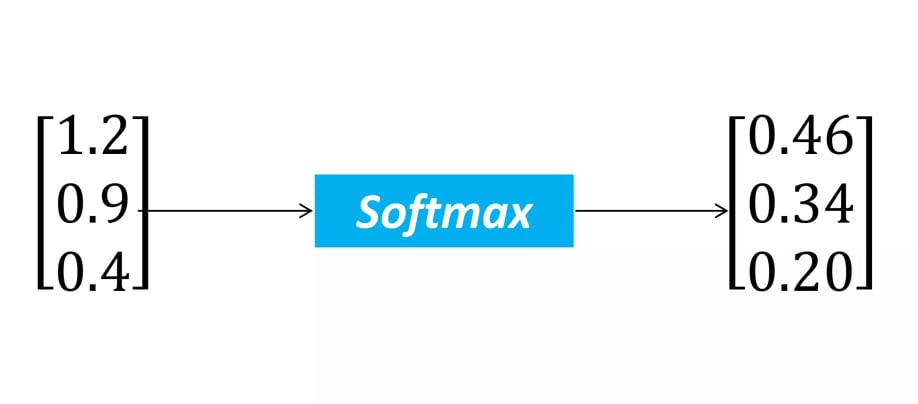

The output of the softmax function is equivalent to a categorical probability distribution, it tells you the probability that any of the classes are true.

Mathematically the softmax function is shown below, where z is a vector of the inputs to the output layer (if you have 10 output units, then there are 10 elements in z). And again, j indexes the output units, so j = 1, 2, ..., K.

_j%20=%20\frac{e^{z_j}}{\sum^K_{k=1}e^{z_k}})

Suppose, we have an image where '4' digit is written on it. Now we want character recognition from that image. And we do all process for recognition of the character and make a vector. Now after using softmax function in our result it looks like,

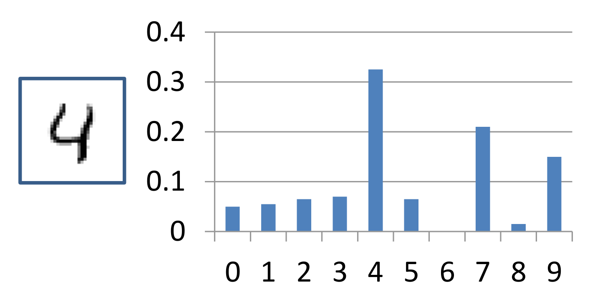

So softmax function is basically making the vector into the probabilistic vector.
</details>

<details>
  <summary>Recurrent neural network (RNN)</summary>

Recurrent Neural Networks (RNNs) are widely used for data with some kind of sequential structure. For instance, time series data has an intrinsic ordering based on time. Sentences are also sequential, "I love dogs" has a different meaning than "Dogs I love." So if you are working with sequential model, RNN might be the solution for that.\\
A simple architecture for RNN

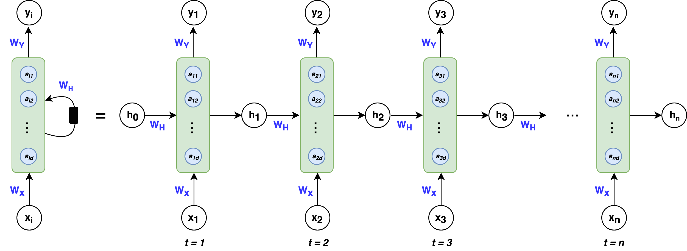

1. **Vector h :** is the output of the hidden state after the activation function has been applied to the hidden nodes. 
   
2. **Matrices Wx, Wy, Wh:** — are the weights of the RNN architecture which are shared throughout the entire network. The model weights of Wx at t=1 are the exact same as the weights of Wx at t=2 and every other time step.
   
3. **Vector Xi:** is the input to each hidden state where i=1, 2,…, n for each element in the input sequence.

We can make divide full architecture with two part.
1. Forward Propagation
2. Backpropagation through time

**Forward Propagation:**

In Forward Propagation, we calculate everything. Like, output,hidden state,loss function,gradient etc.

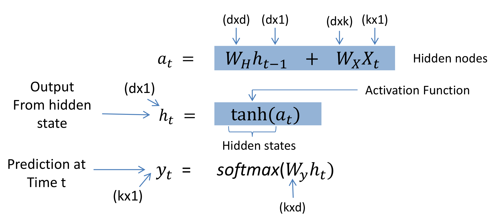
Here,
* **k** is the dimension of the input vector Xi
  
* **d** is the number of hidden nodes

Loss function is calculated by multi-class cross entropy loss function.

%20=%20-y_t%20log(\hat%20y_t))

OverAll loss function is calculated by below equation.

%20=%20-\sum^n_{t=1}%20y_t%20\log(\hat%20y_t))

For gradient calculation of ,


For gradient Calculation of ,


**BackPropagation through time:**

In backward Propagation, It's updated  ,  , value based on gradients.

So, overall process look like,

1. Initialize weight matrices Wx, Wy, Wh randomly

2. Forward propagation to compute predictions

3. Compute the loss

4.Backpropagation to compute gradients

5. Update weights based on gradients

6. Repeat steps 2–5

A problem that RNNs face, which is also common in other deep neural nets, is the **vanishing gradient problem** . Vanishing gradients make it difficult for the model to learn long-term dependencies. For example, if an RNN was given this sentence,

```
The brown and black dog,which was playing with cat, was a German shepherd
```
in this sentence, when we want to predict 'shepherd', it needs the input brown. But 'brown' is too far from 'shepherd'. A long term dependency occurs. And it creates gradient loss. Cause gradient follows chain rule.
However, there have been advancements in RNNs such as gated recurrent units (GRUs) and long short term memory (LSTMs) that have been able to deal with the problem of vanishing gradients.

</details>


<details>
  <summary>Gated Recurrent Unit(GRU)</summary>

To solve the vanishing gradient problem of a standard RNN, GRU uses, so-called, update gate and reset gate. Basically, these are two vectors which decide what information should be passed to the output. The special thing about them is that they can be trained to keep information from long ago, without washing it through time or remove information which is irrelevant to the prediction.
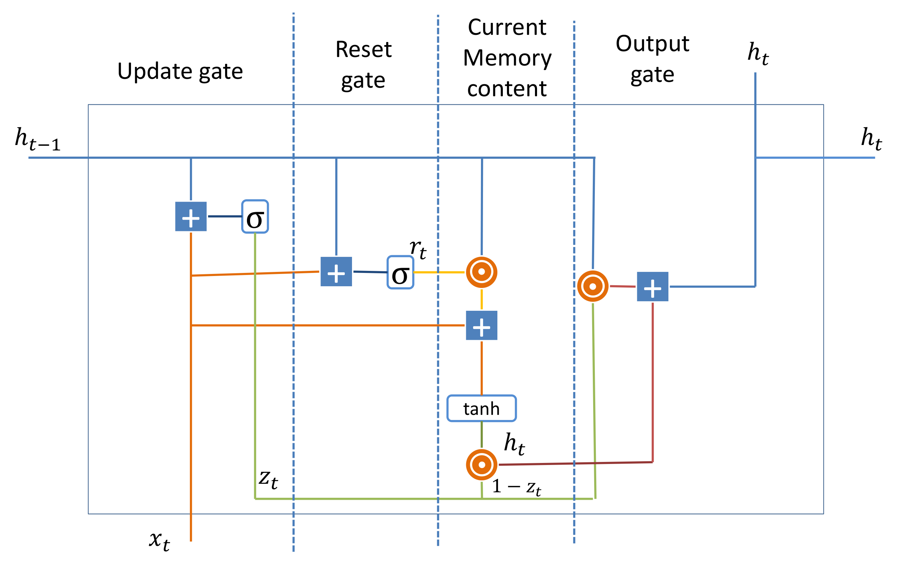

**Update Gate:**
We start with calculating the update gate $Z_t$ for time step t using the,

}%20x_t%20+%20U^{(z)}%20h_{t-1}))


The update gate helps the model to determine how much of the past information (from previous time steps) needs to be passed along to the future.

**Reset Gate:** this gate is used from the model to decide how much of the past information to forget. To calculate it, we use:

}x_t%20+%20U^{(r)}h_{t-1}))


**Current memory content:**
This is a big process, because output depends on it. We can divide it with 4 section.

)

1. Multiply the input  with a weight W and  with a weight U.

2. Calculate the Hadamard (element-wise) product between the reset gate  and . That will determine what to remove from the previous time steps.
3. Sum up the results of step 1 and 2.
4. Apply the nonlinear activation function tanh.

**Final memory at current time step:** This is the output state. Here we computes output from previous computation.

\odot%20h_t)

1. Apply element-wise multiplication to the update gate  and  .
2. Apply element-wise multiplication to  and  .
3. Sum the results from step 1 and 2.

</details>


<details>
  <summary>LSTM</summary>
Long Short Term Memory are a special kind of RNN, capable of learning long-term dependencies. They were introduced by Hochreiter \& Schmidhuber (1997) [20], and were refined and popularized by many people in following work. Lstm architecture is similar to GRU.

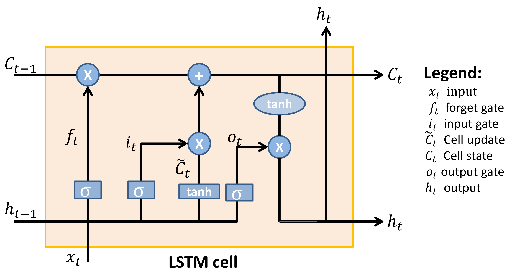

We can divide whole architecture with 4 section,

**1. Forget gate(  ):**
The first step in our LSTM is to decide what information we’re going to throw away from the cell state. This decision is made by a sigmoid layer called the “forget gate layer.” It looks at ) and , and outputs a number between 0 and 1 for each number in the cell state . 
**1** represents “completely keep this” while a **0** represents “completely get rid of this.”

)

**2. input gate ( ):** The next step is to decide what new information we’re going to store in
the cell state. This has two parts. First, a sigmoid layer called the “input gate layer” 
decides which values we’ll update. Next, a tanh layer creates a vector of new candidate 
values, , 
that could be added to the state. In the next step, we’ll combine these two to create an 
update to the state.

)

)

**3. update old state:** It’s now time to update the old cell state, , into the new cell state . The previous steps already decided what to do, we just need to actually do it.

We multiply the old state by , forgetting the things we decided to forget earlier. Then we add . This is the new candidate values, scaled by how much we decided to update each state value.

)

**4. output Gate:** Finally, we need to decide what we’re going to output. This output will be based on our cell state, but will be a filtered version. First, we run a sigmoid layer which decides what parts of the cell state we’re going to output. Then, we put the cell state through tanh (to push the values to be between - and 1 and multiply it by the output of the sigmoid gate, so that we only output the parts we decided to.

)

*%20o_t)

</details>


<details>
  <summary>Feed forward neural network</summary>

Feed forward neural network is a simple one directional neural network. In RNN there a backward propagation but here only forward propagation. But in this neural network there is a lots of hidden layer for decision making. for computing hidden layer, in this network sigmoid function is used. output layer is only 1 and 0 activation function. Thats why this network is simplest neural network.


</details>

<details>
  <summary>Bidirectional RNN (BRNN)</summary>

In 1997 Schuster & mike proposed bidirectional model of RNN [26].

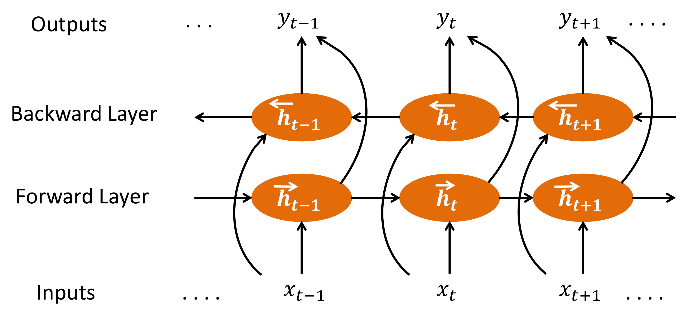

The idea is to split the state neurons of a regular RNN in a part that is responsible for the positive time direction (forward states) and a part for the negative time direction (backward states). Outputs from forward states are not connected to inputs of backward states, and vice versa.

**FORWARD PASS:** \
Run all input data for one time slice through 
 the BRNN and determine all
predicted outputs.
1. Do forward pass just for forward states (from t=1
to t=T ) and backward states (from t=T to t=1).
2. Do forward pass for output neurons.

**BACKWARD PASS:** \
Calculate the part of the objective function derivative
for the time slice  used in the forward pass.
1. Do backward pass for output neurons.
2. Do backward pass just for forward states (from t=T
to t=1 ) and backward states (from t=1
to t=T).
</details>

<details>
  <summary>Convolution Neural Network(CNN)</summary>

CNN was introduced by LeCun at 1998 [27]. Images recognition, images classifications. Objects detections, recognition faces etc., are some of the areas where CNNs are widely used.


We already know what is **Relu** Layer.

**Padding:** \
Sometimes filter does not fit perfectly fit the input image. We have two options for padding:

1. Pad the picture with zeros (zero-padding) so that it fits
   
2. Drop the part of the image where the filter did not fit. This is called valid padding which keeps only valid part of the image.

**pooling:**
Pooling layers section would reduce the number of parameters when the images are too large. Spatial pooling also called subsampling or downsampling which reduces the dimensionality of each map but retains important information. Spatial pooling can be of different types:

1. Max Pooling
2. Average Pooling
3. Sum Pooling

Max Pooling is the most common among others.Max pooling takes the largest element from the rectified feature map. Taking the largest element could also take the average pooling. Sum of all elements in the feature map call as sum pooling.


**Flattening:** An image is nothing but a matrix of pixel values. 
In Neural network it is difficult to work with 3-dimentional matrix. 
So we make 2D matrix to 1D matrix by flattened for feeding the next layer.

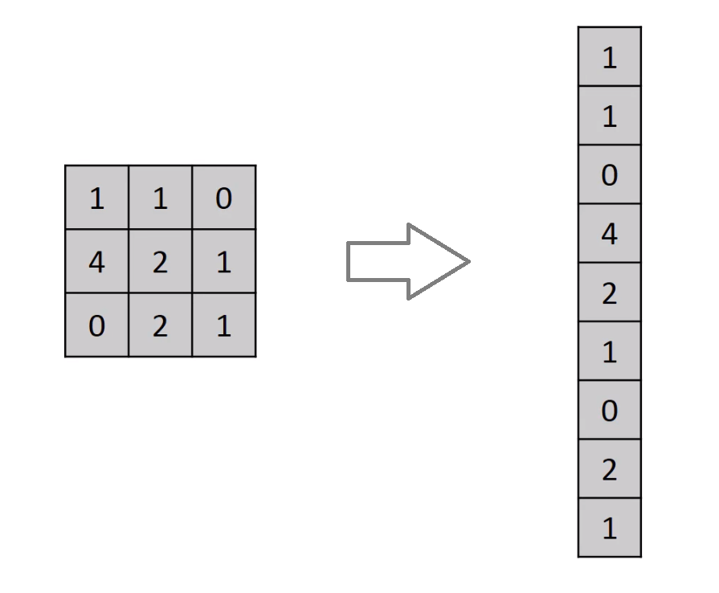


**Fully Connected Layer:** \
The layer we call as FC layer, we flattened our matrix into vector and feed it into a 
fully connected layer like a neural network. Every node connected to others hidden layer node.

**Process:** 

1. Provide input image into convolution layer
2. Choose parameters, apply filters with strides, padding if requires. Perform convolution on the image and apply ReLU activation to the matrix.
3. Perform pooling to reduce dimensionality size
4. Add as many convolutional layers until satisfied
5. Flatten the output and feed into a fully connected layer (FC Layer)
6. Output the class using an activation function (Logistic Regression with cost functions) and classifies images.


</details>

<details>
  <summary>Encoder-Decoder Model</summary>

The encoder-decoder model is composed of encoder and decoder like its name. The encoder converts an input document to a latent representation (vector), and the decoder generates a summary by using it.
It was develop by google AI [21] and also implemeted it in the google play service. In our message section, this technique is used. So we already know what is it.

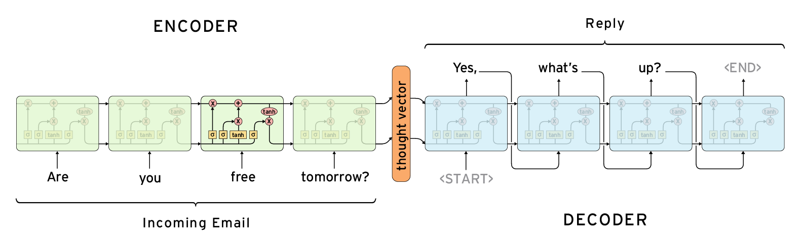

In Encoder part, machine will learn context sequentially. We can use any sequential model 
here for learning purpose. Like, RNN,LSTM,CNN,Seq to seq, GRU etc.
In Decoder part, machine Decode what he learn and it depends on what we want. 
It can be translation,summary,question-answer etc.

In NLP, Encoder Decoder model is hugely used by researcher Cause of good accuracy.
In summarization We will see how to summary a text by encoder decoder.

</details>


<details>
  <summary>Attention Model</summary>

Suppose we want to translate English to bangla.

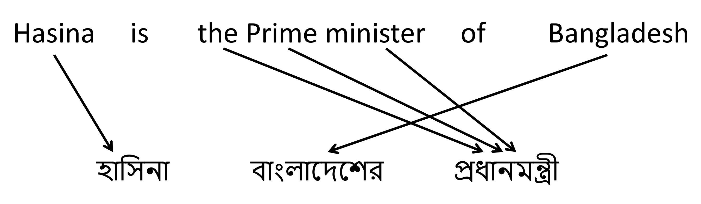

In this figure, You can see when we translate 'Hasina', We don't need to focus 'Bangladesh'. When we decode something, we don't need to focus all the word. Only we need to focus those word who was closely connected. Here 'Attention' mechanism comes.


In This figure, we have a bidirectional RNN for encoder. Now when we decode, 
there is a value comes from every hidden state. Because we need to know which word
we need to focus. This model is proposed by Bahdanau at 2014 [25].

In this architecture, they define each conditional probability,

=g(y_{i-1},s_i,c_i))

where  is an RNN hidden state for time i, computed by

)

The context vector  is, then, computed as a weighted sum of these annotations 


The weight  of each annotation  is computed by

}{\sum^{T_x}_{k=1}\exp(e_{ik})})

where,

)

 is the hidden state of RNN Model


</details>


<details>
  <summary>Seq to Seq model</summary>

This model is one of the famous model in NLP. Why? It can solve different types of difficult task that we can't do with other language. This model is also very fast.
This model was introduced by google at 2014 [30]. This model also based on encoder-decoder architecture.
But we need to give input sequentially and output layer will give us output sequentially. So, there is no big difference.

We can use different types model in encoder and decoder here. Like,

1. RNN or Bidirectional RNN
2. LSTM or Bidirectional LSTM
3. GRU or Bidirectional GRU

</details>


<details>
  <summary>Transformer</summary>

Transfer learning or transformer is the first transduction model relying entirely on self-attention to compute representations of its input and output without using sequence-aligned RNNs or convolution. How? why is this model much important and famous?  This model was introduced by Vaswani at 2017 in his famous paper "Attention is all you need" [37]. They used multi-head attention instead of single-head attention.


From this figure, we can guess how this architecture works.\
We already know about **"Embedding", "Feed Forward neural network",
"Softmax","Normalization"**. Now we will know about **"Multi-Head Attention"** and **"Positional Encoding"**.

**Positional Embedding:** Since this model contains no recurrence and no convolution,
in order for the model to make use of the
order of the sequence, we must inject some information about the relative or absolute position
of the
tokens in the sequence. To this end, they add "positional encodings" to the input embeddings 
at the bottoms of the encoder and decoder stacks. The positional encodings have the same dimension 
as the embeddings, so that the two can be summed. They used sine and cosine function for different frequency.

}=\sin(pos/10000^{2i/d_{model}}))

}=\cos(pos/10000^{2i/d_{model}}))

**Multi-Head Attention:** In single attention, if the input consists of
queries and keys of dimension , and values of dimension , We compute the dot products of the query with all keys, divide each by 
, and apply a softmax function to obtain the weights on the
values.

=softmax(\frac{QK^T}{\sqrt{d_k}})V)

In Multi-Head Attention model, instead of performing a single attention function with $d_{model}$-dimensional keys, values and queries,
we found it beneficial to linearly project the queries, keys and values h times with different, learned
linear projections to ,  and  dimensions, respectively.
Multi-head attention allows the model to jointly attend to information from different representation
subspaces at different positions. With a single attention head, averaging inhibits this

=Concat(head_1,...,head_h)W^O)

where,

)

We have to fixed head size.

**Self Attention:** Self-attention, sometimes called intra-attention, is an attention mechanism relating different positions of a single sequence in order to compute a representation of the sequence.Self-attention allows the model to look at the other words in the input sequence to get a better understanding of a certain word in the sequence. Now, let’s see how we can calculate self-attention.

1. First, we need to create three vectors from each of the encoder’s input vectors: 
    Query Vector,
Key Vector,
Value Vector.
2. Next, we will calculate self-attention for every word in the input sequence
3. Consider this phrase – “Legends Never die”. To calculate the self-attention for the first word “Legends”, we will calculate scores for all the words in the phrase with respect to “legends”. This score determines the importance of other words when we are encoding a certain word in an input sequence

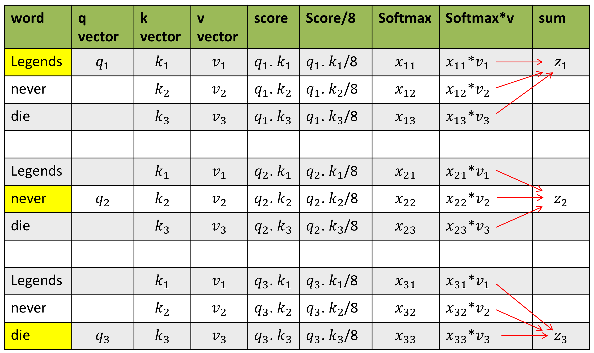


**Encoder:** The encoder is composed of a stack of N = 6 identical layers. Each layer has two
sub-layers. The first is a multi-head self-attention mechanism, and the second is a simple, position wise fully 
connected feed-forward network. We employ a residual connection [10] around each of
the two sub-layers, followed by layer normalization [1]. That is, the output of each sub-layer is
LayerNorm(x + Sublayer(x)), where Sublayer(x) is the function implemented by the sub-layer
itself. To facilitate these residual connections, all sub-layers in the model, as well as the embedding
layers, produce outputs of dimension  = 512.

**Decoder:** The decoder is also composed of a stack of N = 6 identical layers. In addition to the two
sub-layers in each encoder layer, the decoder inserts a third sub-layer, which performs multi-head
attention over the output of the encoder stack. Similar to the encoder, we employ residual connections
around each of the sub-layers, followed by layer normalization. We also modify the self-attention
sub-layer in the decoder stack to prevent positions from attending to subsequent positions. This
masking, combined with fact that the output embeddings are offset by one position, ensures that the
predictions for position i can depend only on the known outputs at positions less than i.


</details>


<details>
  <summary>Teacher Forcing</summary>

Teacher forcing is a strategy for training recurrent neural networks that uses model output from a prior time step as an input. 
Teacher forcing works by using the actual or expected output from the training dataset at the current time step y(t) as 
input in the next time step X(t+1), rather than the output generated by the network.

Lets take an example,

"Dhaka is the capital city of bangladesh". We want to feed this sentence in RNN. We must add [start] and [end] 
token in the sentence. 

now the sentence looks like, "[Start] Dhaka is the capital city of bangladesh [End]".

When we give [Start] token, if it gives "The" as a output, and if we continue this process,
whole sequence will be wrong. The model is in the off track and is going to get punished for every subsequent 
word it generates. This makes learning slower and the model unstable.

Here Teacher Forcing comes, When we calculate error and found we are in off track 
we will replace it with others word. It makes faster the model. 

Lots of teacher forcing approach were invented in recent years, we can use any of it.

</details>


<details>
  <summary>Beam Search</summary>

Let's Think about, after calculating a output vector, how we can predict correct sentence. 
As like as Teacher forcing, If one word is incorrect, entire sequence can be incorrect. 
After using softmax function, If we take always highest value , it may be give wrong value. In greedy search, 
always take highest softmax value.

Instead of taking only maximum value we can take few value with highest softmax value. 
Suppose our Beam=3, We will take 3 value from output vector and make a bfs tree with it.

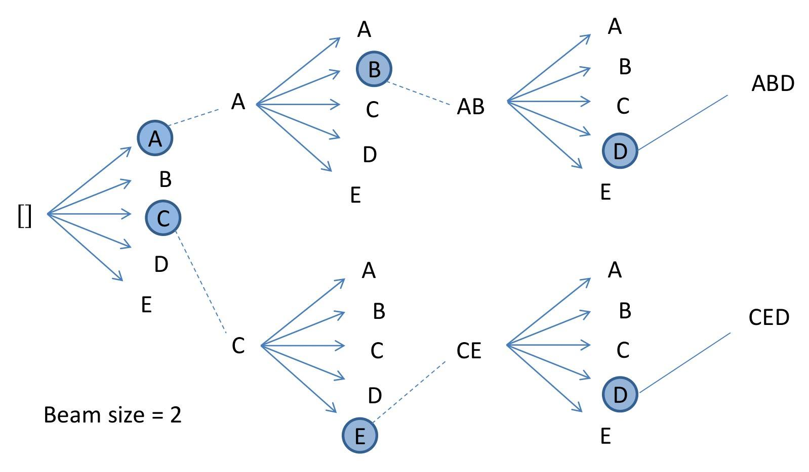


After taking each of them, we will calculate conditional probability with them in each time step.
And we will take maximum probabilistic Sequence for our output.

</details>

### Keyword Extraction techniques

<details>
  <summary>Introduction</summary>
Keyword extraction is tasked with the automatic identification of terms that best describe the subject of a document. Key phrases, key terms, key segments or just keywords are the terminology which is used for defining the terms that represent the most relevant information contained in the document.(source wiki). If you get good keyword from text, your answer will be more accurate.
Maximum extractive and abstractive models depend on keyword Extraction.

</details>


<details>
  <summary>Rules Based Keyword Extraction</summary>

Rules-based Keyword extraction basically conditional or pattern type.
In 2008  Khoury, Richard, Fakhreddine Karray, and Mohamed S. Kamel published a paper about a rules-based model in keyword extraction using parts of speech hierarchy [1]. In this model, they describe, parts of speech have an important role in keyword extraction. They made a supervised learning model and a training corpus.

1. words are split according to their parts of speech tag. 
2. words are divided into different categories.
3. rules and condition check here which looks like a tree, every edge have a different condition.
4. if the word goes to the leaf then we will take it as a keyword.

</details>


<details>
  <summary>Using support vector machine(SVM)</summary>

In machine learning, support vector machines (SVMs, also support vector networks) are supervised learning models with 
associated learning algorithms that analyze data used for classification and regression analysis.
In 2006, Zheng and khuo made a keyword extraction model using SVM [2].

1. **Pre-processing:** For a document, we conduct the sentence split, word tokenization and POS (part-of-speech) tagging by using GATE. Next, employ Linker to analyze the dependency relationships between words in each sentence. After that, we employ tri-gram to create candidate phrases and then filter the phrases whose frequencies are below a predefined threshold. We also exclude the common words in the stop-words list. We conduct gentle stemming by using WordNet. Specifically, we only stem the plural noun, gerund, and passive infinitive by their dictionary form. Finally, we obtain a set of ‘keyword candidate’ for later processing.
2. **Feature extraction:** The input is a bag of words/phrases in a document. We make use of both local context information(POS Feature, Linkage Features, Contextual TFIDF Feature) and global context information(TFIDF Feature, First Occurrence Feature, Position Features) of a word/phrase in a document to define its features. The output is the feature vectors, and each vector corresponds to a word/phrase.
3. **Learning:** The input is a collection of feature vector by step (2). We construct a SVM model that can identify the keyword. In the SVM model, we view a word/phrase as an example, the words/phrases labeled with ‘keyword’ as positive examples, and the other words/phrases as negative examples. We use the labeled data to train the SVM model in advance.
4. **Extraction:** The input is a document. We employ the preprocessing and the feature extraction on it, and obtain a set of feature vectors. We then predict whether or not a word/phrase is a keyword by using the SVM model from step (3). Finally, the output is the extracted keywords for that document.

</details>

<details>
  <summary>Rake Algorithm</summary>
In 2010 Stuart Rose invented new techniques in keyword extraction name Rapid automatic keyword extraction(RAKE).
It was one of the popular algorithms used in finding important keywords. In-text Summarization, this algorithm much popular in keyword extraction.

**Candidate keywords:**  Split the words by tokenizing them. Remove the stop word and delimiters.
All other word is candidate words. Be careful about the position. Cause position matters when we rank them.

**Keyword scores:** Keyword Scores were calculated from the co-occurrence graph.

Suppose we have some word token after stop word remove.
```
Compatibility – systems – linear constraints – set – natural numbers – Criteria –
compatibility – system – linear Diophantine equations – strict inequations – nonstrict
inequations – Upper bounds – components – minimal set – solutions – algorithms –
minimal generating sets – solutions – systems – criteria – corresponding algorithms –
constructing – minimal supporting set – solving – systems – systems
```

For co-occurrence graph we need sorted, unique word. now it looks like,

```
algorithms – bounds – compatibility – components – constraints – constructing – corresponding –
criteria – diophantine – equations – generating – inequations – linear – minimal – natural –
nonstrict – numbers – set – sets – solving – strict – supporting – system – systems – upper
```

In co-occurrence we check for every i,j cell. if i'th row and j'th coloum are related or co-related,
we will increase count of this cell. Table 2.1 and Table 2.2 define us how it works.
[table 1] [table 2]

**Extracted keywords** After candidate keywords are scored, the top T scoring candidates are selected as keywords for the document. We compute T as one-third the number of words
in the graph.
</details>


### Word embedding


<details>
  <summary>Bag of words</summary>

The bag-of-words model is a simplifying representation used in natural language processing and information retrieval (IR).
In this model, a text (such as a sentence or a document) is represented as the bag (multiset) of its words, disregarding
grammar and even word order but keeping multiplicity.The bag-of-words model is commonly used in methods of document 
classification where the (frequency of) occurrence of each word is used as a feature for training a classifier.
An early reference to "bag of words" in a linguistic context can be found in Zellig Harris's 1954 article on Distributional Structure.[source: wiki]
Bag of words process has two steps.

**Tokenization:**  First we tokenize whole sentences.
**Vectors Creation:**
	after doing the first step, we will make a vector for each sentence.
	Dividing sentences into words and creating a list with all unique words and also in alphabetical order. \\
Let's take an example with three-sentence,
```
 John likes to watch movies.
 Mary likes movies too.
 Mary also likes to watch football games.
```
Now after tokenization, our word list look like,

```
[also,football,games,john,likes,mary,movies,to,too,watch]
```

After that we need to compute sparse matrix. This sparse matrix represent the bag of words.
In sparse matrix every cell represent, **occurence of j'th word in i'th sentence**. 

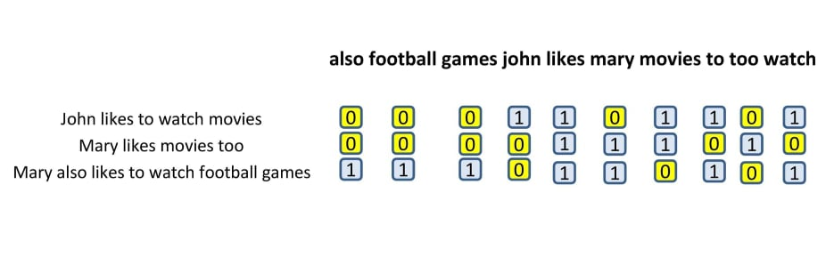
</details>


<details>
  <summary>TF-IDF</summary>

TF-IDF value will be increased based on frequency of the word in a document. Like Bag of Words in this technique also we can not get any semantic meaning for words. \\
But this technique is mostly used for document classification and also 
successfully used by search engines like Google, as a ranking factor for content.

Suppose we have three sentences.
```
A. This pasta is very tasty and affordable.
B. This pasta is not tasty and is affordable.
C. This pasta is very very delicious.
```
Let's consider each sentence as a document. Here also our first task is tokenization (dividing sentences into words or tokens) and then taking unique words.

[table 3]

</details>


<details>
  <summary>Word2vec</summary>

The Word2Vec model is used for learning vector representations of words called “word embeddings”. In the previous methods, there was no semantic meaning from words of corpus. 
Word2vec model takes input as a large size of the corpus and produces output to vector space. This vector space size may be in hundred of dimensionality. Each word vector will be placed on this vector space.
word2vec uses 2 types of methods. There are

1. Skip-gram
2. CBOW (Continuous Bag of Words)


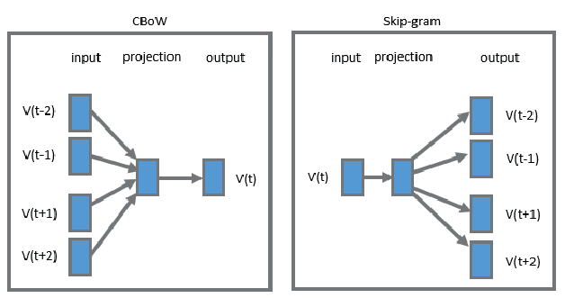

Here one more thing we have to discuss that is window size. window size basically 1-gram,bi-gram,tri-gream,N-gram model.

</details>

<details>
  <summary>Skip gram (word2vec p1)</summary>
In this method , take the center word from the window size words as an input and context words (neighbour words) as outputs. Word2vec models predict the context words of a center word using skip-gram method. Skip-gram works well with a small dataset and identifies rare words really well.
In 2013 Mikolov first time told about this method [3].


According to Fig,

1. Both the input word **wi** and the output word **wj** are one-hot encoded into binary vectors **x** and **y** of size V.
2. First, the multiplication of the binary vector x and the word embedding matrix **W** of size 
   **V×N** gives us the embedding vector of the input word **wi** the i-th row of the matrix 
   **W**.
3. This newly discovered embedding vector of dimension N forms the hidden layer.
4. The multiplication of the hidden layer and the word context matrix 
   **W'** of size **N×V** produces the output one-hot encoded vector **y**.
5. The output context matrix **W'** encodes the meanings of words as context, 
   different from the embedding matrix W. NOTE: Despite the name, **W'** is independent of 
   **W**, not a transpose or inverse or whatsoever.

</details>

<details>
  <summary>Cbow (word2vec p2)</summary>
The Continuous Bag-of-Words (CBOW) is another similar model for learning word vectors. It predicts the target word (i.e. “swing”) 
from source context words (i.e., “sentence should the sword”).
Because there are multiple contextual words, we average their corresponding word vectors, constructed 
by the multiplication of the input vector and the matrix \emph{W}. Because the averaging stage smoothes over a lot
of the distributional information, some people believe the CBOW model is better for small dataset.


</details>


<details>
  <summary>Loss function (word2vec p3)</summary>
Both the skip-gram model and the CBOW model should be trained to minimize a well-designed loss/objective function. 
There are several loss functions we can incorporate to train these language models. like,

1. Full Softmax
2. Hierarchical Softmax
3. Cross Entropy
4. Noise Contrastive Estimation (NCE)
5. Negative Sampling (NEG)
</details>


<details>
  <summary>Difference between CBOW and skip-gram model(word2vec p4)</summary>

</details>


<details>
  <summary>Glove</summary>
GloVe stands for global vectors for word representation. It is an unsupervised learning algorithm 
developed by Stanford for generating word embeddings by aggregating global word-word co-occurrence matrix from a corpus. 
The resulting embeddings show interesting linear substructures of the word in vector space.
GloVe is essentially a log-bilinear model with a weighted least-squares objective. The main intuition underlying the model 
is the simple observation that ratios of word-word co-occurrence probabilities have the potential for encoding some form of meaning. In Glove we also create sparse matrix.
It was directly involved in the probability matrix.

For example, consider the co-occurrence probabilities for target words ice and steam with various probe words from the vocabulary.
Here are some actual probabilities from a 6 billion word corpus:

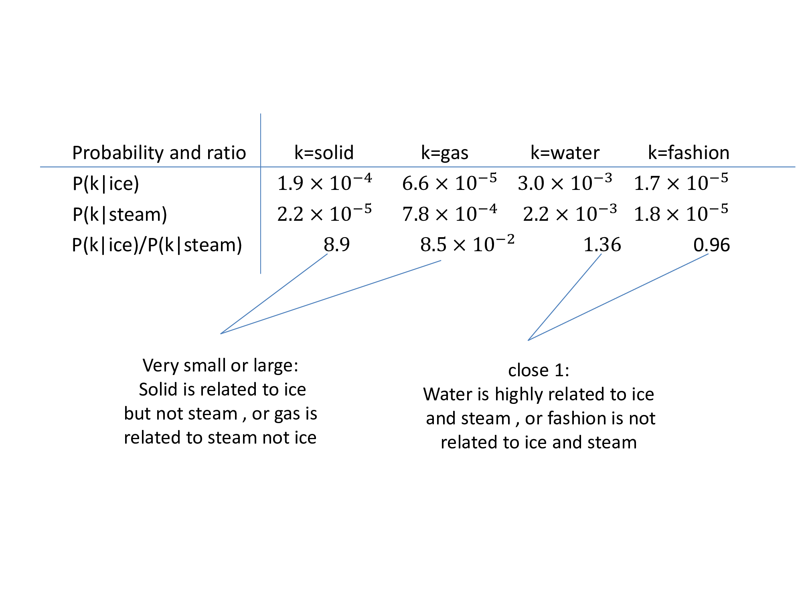

</details>


<details>
  <summary>Fasttext</summary>

Compared to other word embedding methods, FastText (Mikolov et al., 2016) is a new approach which can generate competitive results.[4] [5] This technique is much popular.

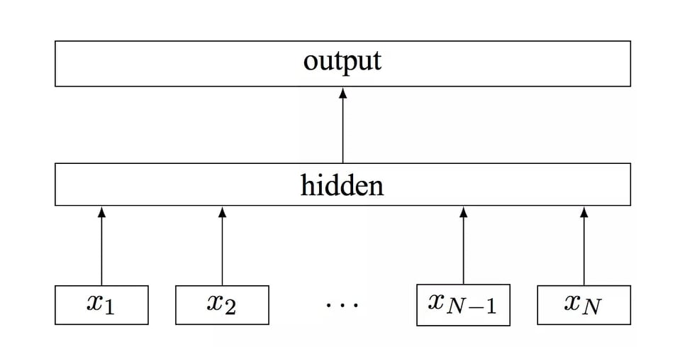

According to the main paper, the model is a simple neural network with only one layer.
The bag-of-words representation of the text is first fed into a lookup layer, 
where the embeddings are fetched for every single word. Then, those word embeddings are 
averaged, so as to obtain a single averaged embedding for the whole text. At the hidden layer
we end up with **(n\_words x dim)** number of parameters, where dim is the size of the 
embeddings and n\_words is the vocabulary size. After the averaging, we only have a single 
vector which is then fed to a linear classifier: we apply the softmax over a linear transformation of the output of the input layer. The linear transformation is a matrix with {\bf (dim x n\_output)}, where {\bf n\_output} is the number output classes. In the original paper, the final log-likelihood is:

))


where,
1.  is the original one-hot-encoded representation of a word (or n-gram feature),
2. A is the look-up matrix that retrieves the word embedding,
3. B is the linear output transformation,
4. f is the softmax function

</details>

### Sentence Embedding

<details>
  <summary>Introduction</summary>

Instead of dealing with words, we can directly work with the sentence. how? 
Sentence embedding is the answer. Sentence embedding also makes semantic information 
in vector.

Suppose we have two sentences, 'I don’t like crowded places',
'However, I like one of the world’s busiest cities, New York'. 
Here, How can we make the machine draw the inference between ‘crowded places’
and ‘busy cities’?

Word embedding can't do that. But we can do it by sentence embedding.
There are lots of techniques in recent years. We will talk about a few of them.

1. Doc2Vec
2. SentenceBERT
3. InferSent
4. Universal Sentence Encoder

</details>


<details>
  <summary>Doc2vec</summary>

An extension of Word2Vec, the Doc2Vec embedding is one of the most popular techniques out there.
Introduced in 2014, it is an unsupervised algorithm and adds on to the Word2Vec model by introducing another ‘paragraph vector’ by T mikolov [6]. In 2015 it was improved by Andrew [7]. Also, there are 2 ways to add the paragraph vector to the model. 
one is PVDM and another PVDOBW.
</details>


<details>
  <summary>PVDM(Distributed Memory version of Paragraph Vector)</summary>

We assign a paragraph vector sentence while sharing word vectors among all sentences. Then we either average or concatenate the (paragraph vector and words vector) to get the final sentence representation.
If you notice, it is an extension of the Continuous Bag-of-Word type of Word2Vec where we predict the next word given a set of words. It is just that in PVDM, we predict the next sentence given a set of sentences.

</details>

<details>
  <summary>PVDOBW( Distributed Bag of Words version of Paragraph Vector)</summary>

PVDOBW is the extention of Skip-gram model in Word2vec. Here, we just sample random words from the sentence and make the model predict which sentence it came from(a classification task).


PVDM is more than enough for most tasks.But we can use both parallelly.
</details>

<details>
  <summary>SentenceBERT</summary>

Currently, the leader among the pack, SentenceBERT was introduced by Reimers in 2018 [8] 
and immediately took the pole position for Sentence Embeddings. At the heart of this 
BERT-based model, there are 4 key concepts:

1. Attention
2. Transformers
3. BERT
4. Siamese Network


we will discuss BERT,transformers,Attention model later.

Sentence-BERT uses a Siamese network like architecture to provide 2 
sentences as an input. These 2 sentences are then passed to BERT models and a pooling layer 
to generate their embeddings. Then use the embeddings for the pair of sentences as inputs to 
calculate the cosine similarity.

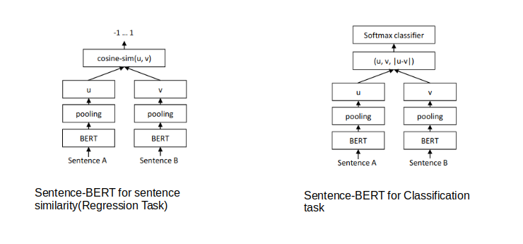

Suppose we have some sentences.

1. I ate dinner. 
2. We had a three-course meal.
3. Brad came to dinner with us.
4. He loves fish tacos.",
5. In the end, we all felt like we ate too much.
6. We all agreed; it was a magnificent evening.

Now, if we want to find the similarity between these sentences with 
**"I had pizza and pasta"**. SentenceBert will give us.

[table 4]

</details>

<details>
  <summary>InferSent</summary>

InferSent is a sentence embeddings method that provides semantic sentence representations 
invented by A Conneau in 2017 [9]. It is trained on natural language inference data and 
generalizes well to many different tasks.

In this model,they examine standard recurrent models such as LSTMs and
GRUs, for which we investigate mean and maxpooling over the hidden representations; 

The architecture consists of 2 parts:

1. One is the sentence encoder that takes word vectors and encodes sentences into vectors
2. Another, NLI classifier that takes the encoded vectors in and outputs a class among entailment, contradiction and neutral.

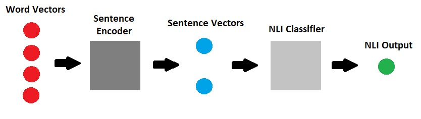

In the author paper, four types of sentence encoder were discussed.

</details>
<details>
  <summary>InferSent part1: Sentence Encoder(LSTM and GRU)</summary>

First, and simplest, encoders apply recurrent neural networks using either LSTM or GRU modules, as in sequence to sequence encoders. For a sequence of T words (w1, . . . , wT ), the network computes a set of T hidden representations h1, . . . , hT , with ht = -> LSTM(w1, . . . , wT ) (or using GRU units instead). A sentence is represented by the last hidden vector, hT.

</details>

<details>
  <summary>InferSent part2: Sentence Encoder (BiLSTM with max/mean pooling)</summary>

It’s a bi-directional LSTM network which computes n-vectors for n-words and each vector is a 
concatenation of output from a forward LSTM and a backward LSTM that read the sentence in 
opposite direction. Then a max/mean pool is applied to each of the concatenated vectors to 
form the fixed-length final vector.
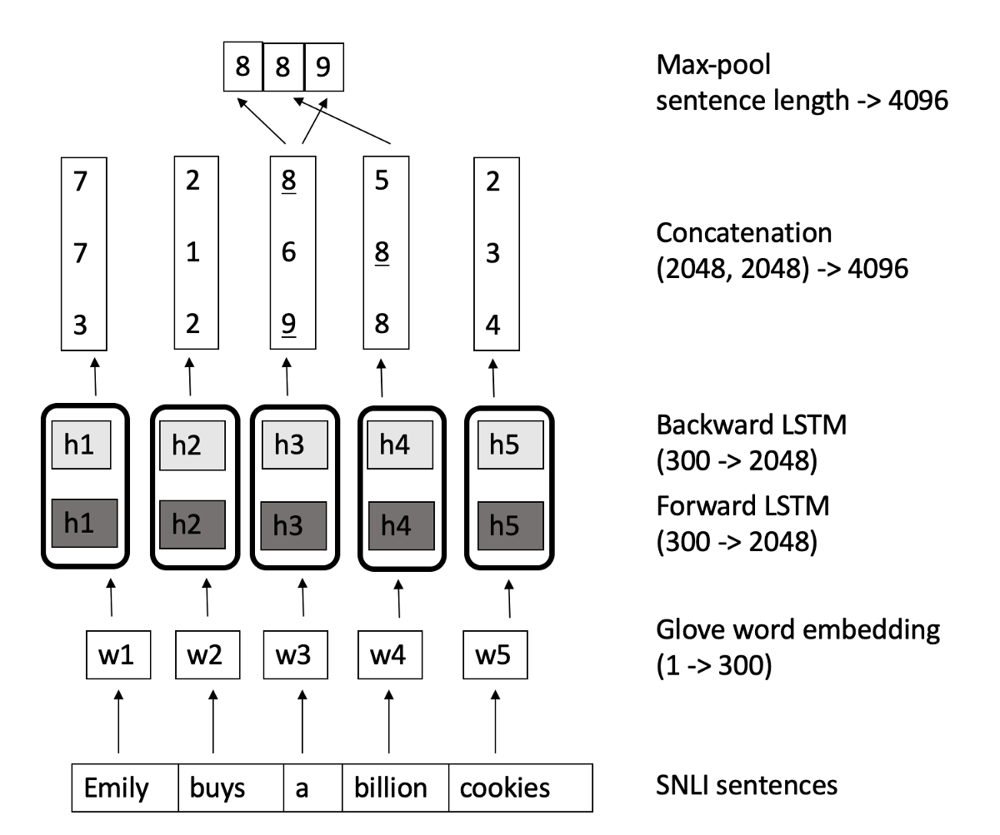

</details>

<details>
  <summary>InferSent part3: Sentence Encoder (Self-attentive network)</summary>

The self-attentive sentence encoder uses an attention mechanism over the hidden states of a BiLSTM to generate a representation u of an input sentence. The attention mechanism is defined as,

)


Where  are the output hidden 
vectors of BiLSTM. These are fed to an affine transformation ) 
which outputs a set of keys ).
The  represent the score of similarity 
between the keys and learned context query vector . 
These weights are used to produce the final representation u, 
Which is a linear combination of the hidden vectors.

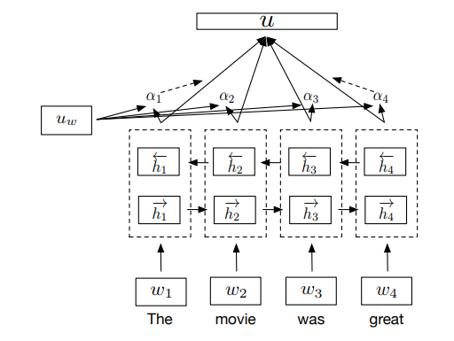

</details>

<details>
  <summary>InferSent part4: Sentence Encoder( Hierarchical ConvNet)</summary>

One of the currently best performing models on classification tasks is a convolutional architecture termed AdaSent, which concatenates different representations of the sentences at a different level of abstractions. The hierarchical convolutional network introduced in the paper is inspired by that and comprise 4 convolutional layers. At every layer, max-pooling of the feature maps is done to obtain representation. The final sentence embedding is represented by a concatenation of the 4 max-pooled representations.

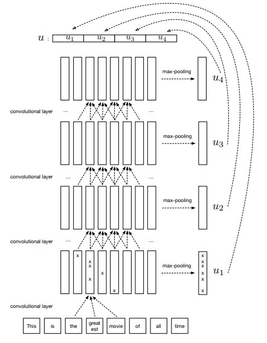
</details>

<details>
  <summary>InferSent part5: Natural Language Inference Classifier(NLI)</summary>

This section discusses the inference classifier network which takes these sentence embeddings and predicts the output label.

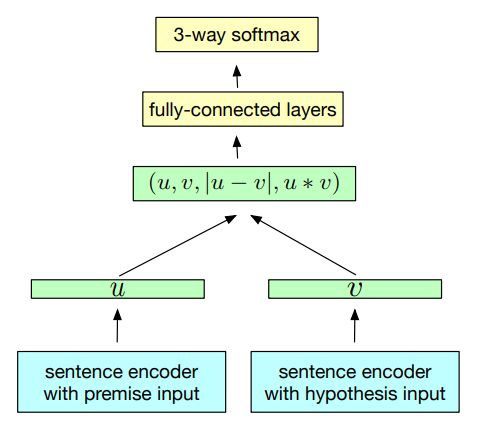
After the sentence vectors are fed as input to this model, 3 matching methods are applied to extract relations between the text, u and hypothesis, v –

1. concatenation of the two representations (u, v)
2. element-wise product (u * v)
3. and, absolute element-wise difference (|u - v|)

The resulting vector captures information from both the text, u and the hypothesis, v, and 
is fed into a 3-class classifier( entailment, contradiction and neutral) consisting of 
multiple fully connected layers followed by a softmax layer.
</details>

<details>
  <summary>Universal Sentence Encoder</summary>

One of the most well-performing sentence embedding techniques right now is the Universal 
Sentence Encoder. And it should come as no surprise from anybody that it has been proposed by Google. The key feature here is 
that we can use it for Multi-task learning.
This means that the sentence embeddings we generate can be used for multiple tasks 
like sentiment analysis, text classification,
sentence similarity, etc, and the results of these asks are then fed back to the model
to get even better sentence vectors that before.

This technique was invented by google and authored Cer and Daniel in 2018 [10]. 


In this model, they use two types of encoder. We can use any of them.

1. Transformer
2.  Deep Averaging Network (DAN)

Both of these models are capable of taking a word or a sentence as input and generating
embeddings for the same. The following is the basic flow:

1. Tokenize the sentences after converting them to lowercase
2. Depending on the type of encoder, the sentence gets converted to a 512-dimensional vector

    1. If we use the transformer, it is similar to the encoder module of the transformer architecture and uses the self-attention mechanism.
    2. The DAN option computes the unigram and bigram embeddings first and then averages them to get a single embedding. This is then passed to a deep neural network to get a final sentence embedding of 512 dimensions.
    
3. These sentence embeddings are then used for various unsupervised and supervised tasks like Skipthoughts, NLI, etc. The trained model is then again reused to generate a new 512 dimension sentence embedding.

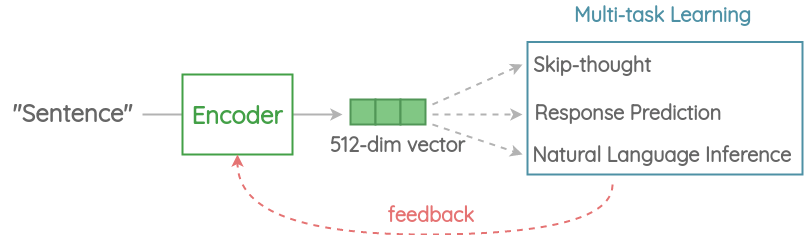

Similarity of two vector:

%20=%20(1-%20\frac{\arccos%20\frac{u.v}{||u||\hspace{2pt}||v||}}{\pi}))
</details>

### End of Pre-Requirements study
<details>
  <summary>Ok i learn about these topics but can't understand how they use these?</summary>

Yeah. It's really tough to understand, how they used these topics in Text summarization models. In my opinion, Maximum models used these topics as a sub-portion. So we need to read a paper sequentially and learn which portion we will do with these topics. 
</details>

## Some common models

